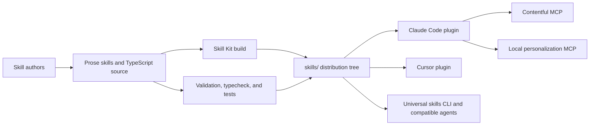

# Architecture

## Overview

This repository is the public distribution source for Contentful agent skills. It contains prose-only skills and a compiled interactive personalization skill, packages them for multiple agent ecosystems, and publishes synchronized repository releases without publishing the root package to npm.

The customer-facing boundary is `skills/`. Internal authoring guidance, TypeScript source, build tooling, release automation, and repository instructions remain outside that directory.

## System context

Consumers install the repository through the Claude plugin marketplace, Cursor plugin metadata, or agentskills-compatible tools such as `npx skills add`. The Claude plugin additionally registers the hosted Contentful MCP endpoint and the local personalization MCP process.

## Repository structure

| Path                                     | Responsibility                                                                                                     |
| ---------------------------------------- | ------------------------------------------------------------------------------------------------------------------ |
| `skills/`                                | Customer-distributed, self-contained skill directories                                                             |
| `skills/contentful-apps/`                | Grouped custom-app skills discovered recursively                                                                   |
| `src/skills/contentful-personalization/` | TypeScript source, tests, schemas, actions, validation, subskills, and source references for the interactive skill |
| `skills/contentful-personalization/`     | Generated Skill Kit output: `SKILL.md`, Node bundle, run script, and copied references                             |
| `local-skills/skills/`                   | Contributor-only authoring and synchronization skills; not customer-distributed                                    |
| `.agents/skills` and `.claude/skills`    | Local contributor-skill projection and Claude compatibility link                                                   |
| `.claude-plugin/`                        | Claude plugin and marketplace manifests, including MCP declarations                                                |
| `.cursor-plugin/`                        | Cursor plugin and marketplace manifests                                                                            |
| `.mcp.json`                              | Repository-level Contentful MCP configuration                                                                      |
| `scripts/update-licenses.mjs`            | Dependency license inventory generation                                                                            |

## Skill authoring flows

### Prose skill

1. An author creates a self-contained directory under `skills/` with `SKILL.md`, `package.json`, and any directly referenced resources.
2. `quick_validate.py` checks the skill frontmatter, naming, and structure.
3. The skills CLI discovery check recursively lists the repository and proves the skill is installable.
4. Plugin manifests enumerate the customer-visible skills for their respective platforms.

### Skill Kit-backed personalization skill

1. Authors change TypeScript, tests, schemas, workflow definitions, and source references under `src/skills/contentful-personalization/`.
2. `pnpm typecheck` and `pnpm test` verify the source behavior.
3. `pnpm build` invokes Skill Kit in Node mode and writes the customer-distributed artifact beneath `skills/contentful-personalization/`.
4. The generated directory, including reference copies and the `.mjs` bundle, is committed with its source change.
5. The run script exposes the built workflow as a local MCP process when the Claude plugin launches it.

Do not hand-edit generated personalization output as a substitute for changing its source and rebuilding.

## Distribution contracts

### Universal skills distribution

The agentskills-compatible distribution boundary is recursive `skills/`. Each skill must be independently installable because the installer copies skill directories without access to repository-external files.

### Claude plugin

`.claude-plugin/plugin.json` points at `./skills` and registers:

- `contentful-mcp`, an HTTP MCP server at `https://mcp.contentful.com/mcp`;
- `contentful-personalization`, a stdio MCP server launched through the distributed personalization run script.

The Claude marketplace manifest explicitly lists all seven current customer-facing skills, including the two nested custom-app skills.

### Cursor plugin

The Cursor plugin and marketplace manifests carry matching repository identity, version, description, and discovery metadata. They do not declare the Claude-specific MCP launch configuration.

## Release flow

1. Pull requests and pushes to `main` validate prose skill structure and discovery, plugin manifests, TypeScript types, and tests.
2. A push to `main` runs release-it unless the commit is already a release commit.
3. Release initialization repeats typecheck and tests; the post-bump hook rebuilds the personalization skill.
4. The bumper updates the root and individual skill versions, personalization source version, and both plugin and marketplace manifests.
5. Release-it creates a conventional-changelog release commit and GitHub release. The root package has `npm.publish: false`.

All version-bearing manifests and generated output must remain synchronized.

## Key invariants

- **Distribution boundary:** only content beneath `skills/` reaches universal skill consumers. A distributed skill cannot depend on `src/`, `local-skills/`, or another sibling skill.
- **Identity:** each `SKILL.md` name matches its immediate directory and its package name follows `@contentful/skill-<name>`.
- **Progressive disclosure:** large or conditional detail belongs in referenced files rather than inflating the skill entrypoint.
- **Machine-readable scripts:** distributed scripts write structured results to stdout and diagnostics to stderr.
- **Generated output:** Skill Kit source and generated personalization artifacts change together.
- **Version synchronization:** root, skill, generated, Claude, and Cursor version fields are updated by the release flow.
- **Public safety:** customer-distributed skills and repository documentation must not contain private URLs, credentials, customer data, or internal-only operational context.

## External dependencies

| Dependency                   | Purpose                                                       | Failure effect                                                       |
| ---------------------------- | ------------------------------------------------------------- | -------------------------------------------------------------------- |
| Node.js 24+ and pnpm 11.22.0 | Repository tooling, tests, builds, and releases               | Local and CI commands cannot run on unsupported toolchains           |
| `@contentful/skill-kit`      | Compiles the interactive personalization workflow             | The generated skill and local MCP cannot be rebuilt when unavailable |
| Python 3                     | Runs repository skill validation                              | Prose-skill validation cannot run when unavailable                   |
| `npx skills`                 | Verifies recursive discovery and universal installation shape | CI cannot prove skills are discoverable                              |
| Claude plugin validator      | Validates Claude manifests                                    | Invalid plugin packaging blocks validation                           |
| Contentful MCP               | Optional live CMS operations for plugin users                 | Prose guidance remains available, but live CMS tools are unavailable |

## Operational knowledge

This repository distributes code and instructions but does not run a customer production service. Availability of installed skills depends on the installation channel, released repository content, and—where used—the external Contentful MCP endpoint or local personalization MCP process.

The daily traffic workflow snapshots GitHub clone, view, and referrer statistics to S3 because GitHub retains those statistics for only 14 days. It is release-independent and does not change distributed skill content.

For a bad release, correct the source and publish a new version; existing consumers remain pinned to or retain the content they previously installed. Security reports follow `SECURITY.md`, while general defects and enhancement requests use GitHub issues.
